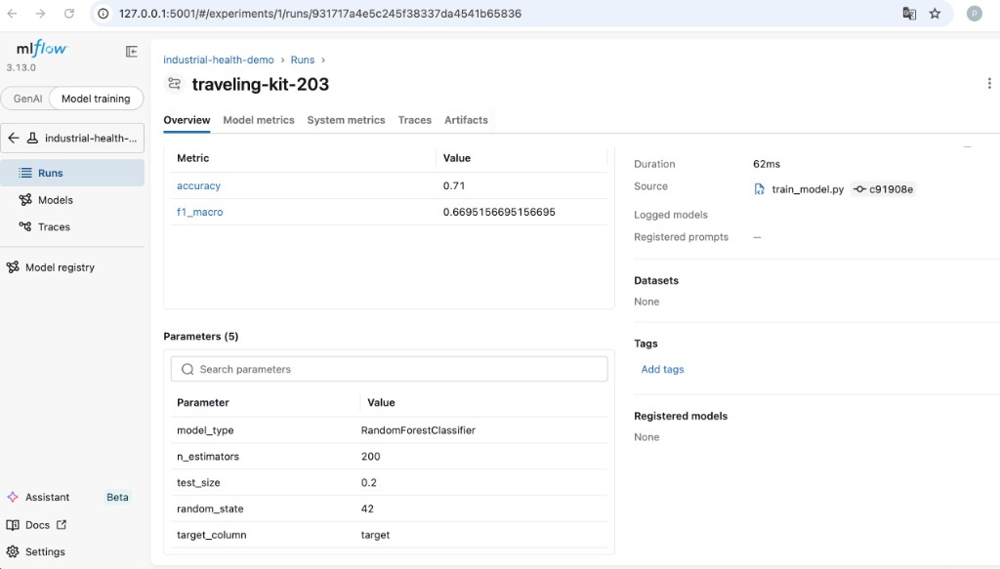
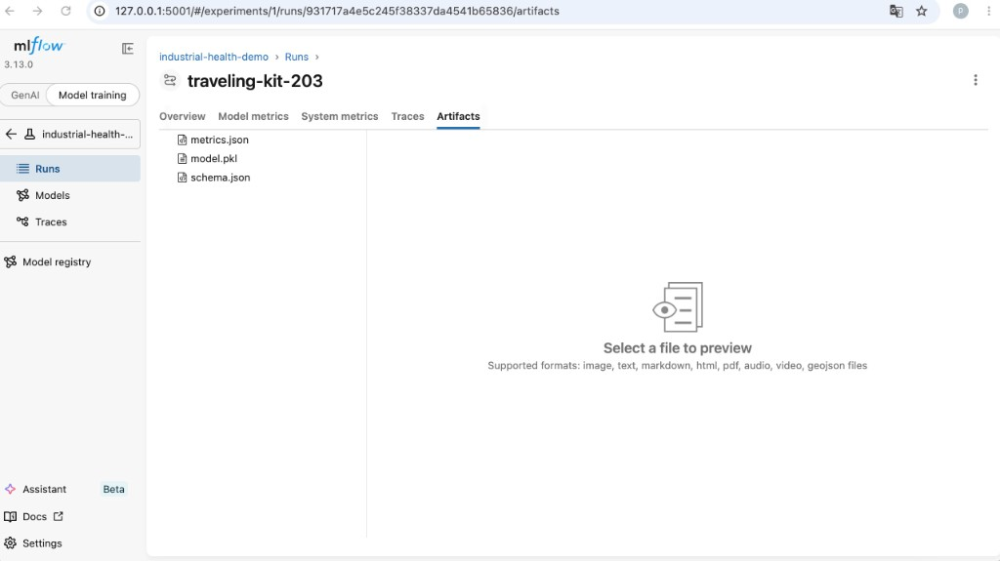
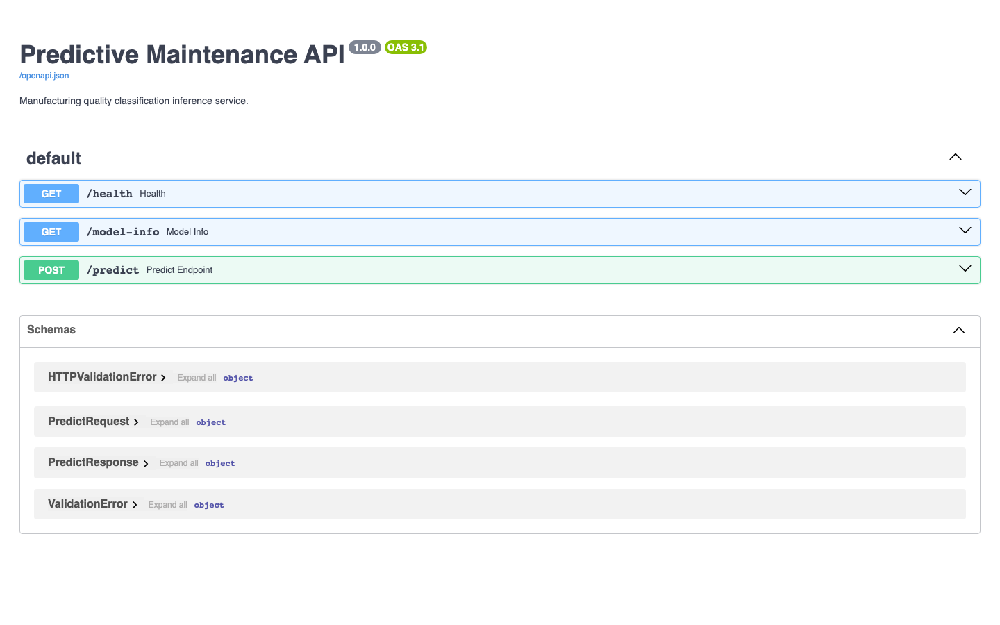
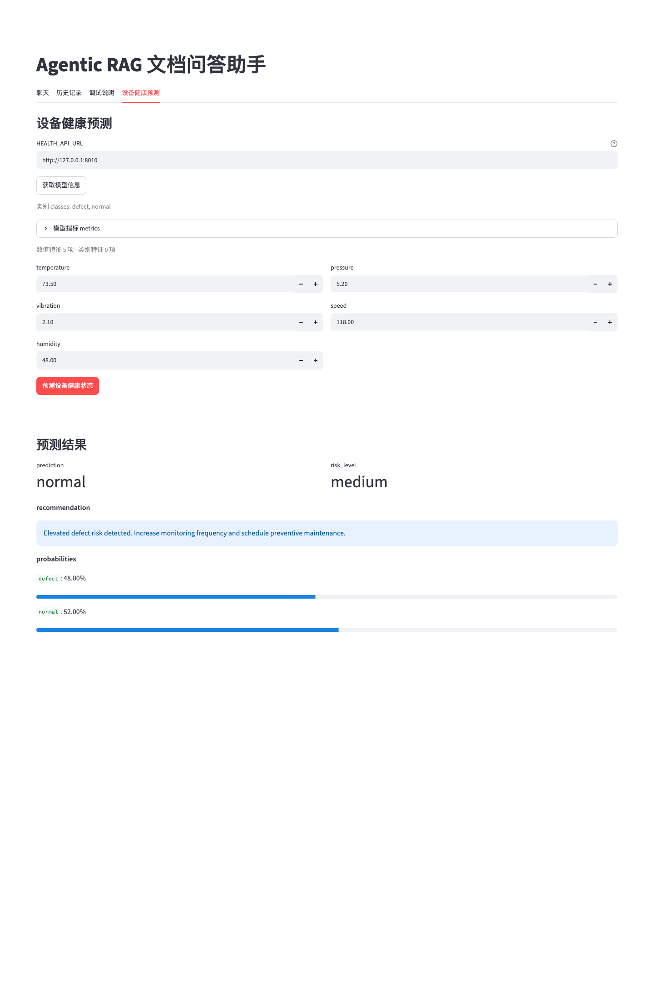

# predictive-maintenance-mini

> 项目仓库：https://github.com/ShihangPENg-afk/predictive-maintenance-mini  
> English README: [README.en.md](README.en.md)

面向 **predictive maintenance（预测性维护）** 与 **manufacturing quality prediction（制造质量预测）** 的工业预测 Mini Demo：涵盖 EDA、模型训练、MLflow 实验追踪、FastAPI 推理与 Docker 部署。

## 关联 GitHub 仓库

| 仓库 | GitHub | 说明 |
|------|--------|------|
| **predictive-maintenance-mini** | https://github.com/ShihangPENg-afk/predictive-maintenance-mini | 本仓库：工业 ML 训练与推理 API |
| **rag-agentic-system** | https://github.com/ShihangPENg-afk/rag-agentic-system | Agentic RAG 主应用；通过 HTTP 调用本服务 |
| **llm-finetune-for-manufacturing** | https://github.com/ShihangPENg-afk/llm-finetune-for-manufacturing | LoRA 微调实验（与工业预测链路无关） |

---

## 1. 项目简介

**predictive-maintenance-mini** 是一个轻量、端到端的工业 ML 流程演示，覆盖两类紧密相关的场景：

- **预测性维护** — 根据传感器读数推断设备 / 批次健康状态
- **制造质量预测** — 将生产批次分类为 `normal`（合格）或 `defect`（不合格）

基于 scikit-learn 的二分类任务：输入产线传感器读数（温度、压力、振动、线速、湿度），输出批次质量标签。

| 阶段 | 脚本 / 组件 | 产出 |
|------|-------------|------|
| EDA | `scripts/eda.py` | `docs/eda_summary.md` |
| 训练 | `scripts/train_model.py` | `artifacts/model.pkl`、`metrics.json`、`schema.json` |
| 实验追踪 | MLflow（SQLite） | `mlflow.db`（已 gitignore） |
| 推理 API | `app/main.py` | `/health`、`/model-info`、`/predict` |
| 容器化 | `Dockerfile` + `docker-compose.yml` | 端口 `8010` |

**数据集**：`data/raw/manufacturing_quality.csv` — 可复现的模拟数据（500 行，无缺失值）。重新生成：`python scripts/generate_sample_data.py`。

---

## 2. ML 流水线

### EDA

```bash
git clone https://github.com/ShihangPENg-afk/predictive-maintenance-mini.git
cd predictive-maintenance-mini
pip install -r requirements.txt
python scripts/eda.py
```

`scripts/eda.py` 读取 CSV，自动识别目标列，输出行列数 / 类型 / 缺失值，统计标签分布与数值特征摘要，并写入 `docs/eda_summary.md`。

### 特征预处理

训练流程（`scripts/train_model.py`）：

1. 读取 CSV，删除 `target` 为空的行
2. 划分数值列与类别列（当前数据集均为数值特征）
3. 预处理：
   - 数值：`SimpleImputer(median)` → `StandardScaler`
   - 类别：`SimpleImputer(most_frequent)` → `OneHotEncoder`（预留，供后续数据集使用）
4. 80/20 分层划分训练集 / 测试集

### RandomForest baseline

当前模型：`RandomForestClassifier`（`n_estimators=200`，`class_weight="balanced"`，`random_state=42`）。

```bash
python scripts/train_model.py
# 或
make train
```

评估指标：`accuracy`、`f1_macro` 及完整 classification report。

### MLflow 实验追踪

每次 run 写入本地 SQLite 后端 `mlflow.db`（已 gitignore）：

- **Experiment 名称**：`predictive-maintenance-mini`
- **记录参数**：`model_type`、`n_estimators`、`test_size`、`random_state`、`target_column`
- **记录指标**：`accuracy`、`f1_macro`

```bash
bash scripts/start_mlflow_ui.sh   # http://127.0.0.1:5001
```

| Run 概览（RandomForest baseline） | Artifacts |
|-----------------------------------|-----------|
|  |  |

### 训练产物

每次训练在 `artifacts/` 下生成三个文件：

| 文件 | 说明 |
|------|------|
| `model.pkl` | 序列化的 sklearn 流水线（预处理器 + 分类器） |
| `metrics.json` | 测试集 accuracy、F1、classification report |
| `schema.json` | 特征名、类别标签、模型元数据 |

**Baseline 结果**（500 行，80/20 划分）：

| 指标 | 值 |
|------|-----|
| accuracy | 0.71 |
| f1_macro | 0.67 |
| defect recall | 0.51 |

完整报告：[`docs/experiment_report.md`](docs/experiment_report.md)。

---

## 3. API 推理服务

FastAPI 推理服务位于 `app/main.py`，需先完成训练（存在 `artifacts/model.pkl`）。

```bash
uvicorn app.main:app --host 0.0.0.0 --port 8010 --reload
```

| 端点 | 方法 | 说明 |
|------|------|------|
| `/health` | GET | 健康检查 |
| `/model-info` | GET | 特征列表、类别、训练指标 |
| `/predict` | POST | 单条样本推理 |

**请求体**（`POST /predict`）：

```json
{
  "features": {
    "temperature": 73.5,
    "pressure": 5.2,
    "vibration": 2.1,
    "speed": 118.0,
    "humidity": 48.0
  }
}
```

**响应**包含 `prediction`、`prediction_label`、`probabilities`、`risk_level`（high / medium / low）及 `recommendation` 文本建议。



**本地调用示例：**

```bash
curl http://127.0.0.1:8010/health
curl http://127.0.0.1:8010/model-info
curl -X POST http://127.0.0.1:8010/predict \
  -H "Content-Type: application/json" \
  -d '{"features":{"temperature":73.5,"pressure":5.2,"vibration":2.1,"speed":118.0,"humidity":48.0}}'
```

**测试：**

```bash
pytest tests/
```

---

## 4. Docker 部署

**前提**：已存在 `artifacts/`（先执行 `make train` 或 `python scripts/train_model.py`）。

```bash
docker compose up --build -d
```

宿主机端口：**8010**。

```bash
curl http://127.0.0.1:8010/health

curl -X POST http://127.0.0.1:8010/predict \
  -H "Content-Type: application/json" \
  -d '{"features":{"temperature":73.5,"pressure":5.2,"vibration":2.1,"speed":118.0,"humidity":48.0}}'
```

Makefile 快捷命令：`make docker-up`、`make docker-verify`、`make docker-logs`、`make docker-down`。

---

## 5. Agent 集成

本服务与 [rag-agentic-system](https://github.com/ShihangPENg-afk/rag-agentic-system) 通过 **HTTP 解耦部署**（独立仓库，无共享代码或数据库）：

| 服务 | 端口 | 角色 |
|------|------|------|
| predictive-maintenance-mini | 8010 | 提供 `/health`、`/model-info`、`POST /predict` |
| rag-agentic-system | 8000 | Agent 工具 `check_machine_health` 调用本 API |
| Streamlit UI | 8501 | 「设备健康预测」Tab，通过 `HEALTH_API_URL` 连接 |

rag-agentic-system 中的 `check_machine_health` 工具将传感器读数发送至 `POST /predict`，并向 Agent 返回 `prediction`、`risk_level` 与 `recommendation`。

详见 rag-agentic-system 文档：[industrial_demo_guide.md](https://github.com/ShihangPENg-afk/rag-agentic-system/blob/main/docs/industrial_demo_guide.md)。



---

## 6. 已知限制

- **仅 baseline 模型** — RandomForest 固定超参，未做超参搜索或集成调优
- **非 SOTA** — 不以追求最优精度为目标
- **未经生产验证** — 演示 / POC 用途，不可用于真实生产决策
- **模拟 / 示例数据** — 数据集为可复现模拟数据（500 行），非真实工厂遥测，泛化能力有限
- **类别不均衡** — 当前划分下 defect recall 偏低（约 0.51）
- **静态产物** — 不支持在线再训练、A/B 测试或模型热更新

---

## 项目结构

```
predictive-maintenance-mini/
├── app/              # FastAPI 推理服务
├── artifacts/        # model.pkl、metrics.json、schema.json
├── data/raw/         # 模拟 CSV
├── docs/             # EDA 摘要、实验报告、展示截图
├── scripts/          # EDA、训练、数据生成、工具脚本
├── tests/            # API 冒烟测试
├── Dockerfile
├── docker-compose.yml
└── Makefile
```

## License

MIT — 详见 [LICENSE](LICENSE)。
